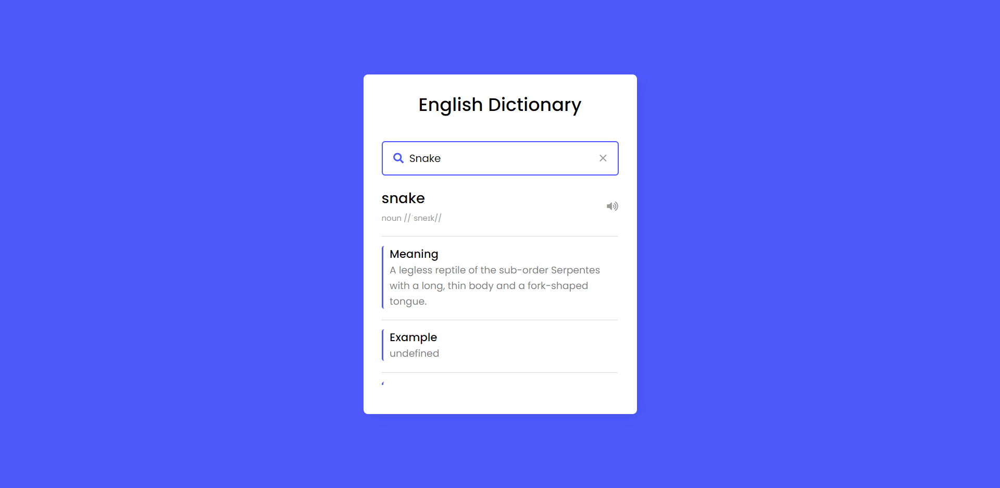

  

<h1 align="center">
  Dictionary App
</h1>

<h3 align="center">
  Dictionary App with API Integration | Web Application
</h3>

  

Welcome to the Dictionary App repository! This project is designed to provide an interactive and feature-rich dictionary experience for users. The app leverages a powerful Dictionary API to fetch comprehensive word definitions, synonyms, and example sentences. Let's dive into the details of this repository.

### Contributions:

Contributions to this repository are highly encouraged! Whether it's improving the UI/UX, adding new features, or enhancing the API integration, your contributions can help make this Dictionary App even better. Feel free to fork the repository, make changes, and submit pull requests to contribute to the project's growth and refinement.

### Get Started:

To start using the Dictionary App, simply clone this repository to your local machine. Ensure you have the necessary dependencies installed and configured correctly. You may also need to obtain an API key for the Dictionary API and configure it in the app.
  
Join us in this exciting journey of building a powerful and user-friendly Dictionary App. Let's empower users with a comprehensive tool for expanding their vocabulary, improving pronunciation, and deepening their language understanding. Happy exploring and learning with the Dictionary App!

  
<!-- ................................................................................................................................. -->

### Features
 
Following are some of the new features and learning encountered while creating this amazing project:

- Word Definitions:   With the help of the Dictionary API, the app allows users to search for word definitions. Simply enter a word in the search bar, and the app will retrieve accurate and detailed definitions for the queried word.
- Synonyms:   Enhancing the vocabulary-building experience, the app displays synonyms for each word. Users can explore alternative words with similar meanings, expanding their linguistic knowledge and enriching their language skills.
- Example Sentences:   Contextual understanding is crucial for learning new words. The app provides example sentences that demonstrate the word usage in proper contexts. This feature enables users to grasp the practical application of words and encourages effective communication.
- Text-to-Speech:   To further enhance user experience and pronunciation skills, the app incorporates a text-to-speech functionality. By clicking on the speaker icon next to each word, users can listen to the correct pronunciation, improving their spoken language skills.
- User-friendly Interface:   The app boasts a clean and intuitive user interface, ensuring a seamless experience for users. The search functionality is prominently displayed, and the retrieved word information is presented in a clear and organized manner. Users can effortlessly navigate through the app and access desired word details.
- Responsive Design:   The app is designed to be fully responsive, adapting flawlessly to various screen sizes and devices. Whether accessing the app on a desktop, tablet, or mobile device, users can enjoy a consistent and visually appealing experience.
- API Integration:   The app utilizes a robust and reliable Dictionary API to fetch word data. This API integration ensures that the app delivers accurate and up-to-date information, providing users with reliable word definitions, synonyms, and example sentences.

  
<!-- ................................................................................................................................. -->

### Demo

  The Demo of this working project can be found on  
  <a href="https://rebrand.ly/DictionaryApp_MABCORP">rebrand.ly/DictionaryApp_MABCORP</a>

  
<!-- ................................................................................................................................. -->

### App'sInterface   

 Fig: Dictionary App Interface

  
<!-- ................................................................................................................................. -->

### Technology Stack
 
Follwing technologies have been used at the core of this application to make it stand in the market place:

- HTML
- CSS
- JavaScript

  
<!-- ................................................................................................................................. -->

### Advancement

> Nothing Yet

  
<!-- ................................................................................................................................. -->

### Deployment Details

The website is deployed using the free hosting provided by **Vercel**

  

  
Later on the link was customized using the well-known URL shortener and customizer **Rebrandly**:  

  

  
<!-- ................................................................................................................................. -->

### Developer

Muhammad Abdullah Butt  
abdullahbutt12292210@gmail.com  
> [Instagram](https://www.instagram.com/abdullah.butt.22/) 
> [FaceBook](https://www.facebook.com/profile.php?id=100076291614529) 
> [YouTube](https://www.youtube.com/channel/UCnuOFQyMywg-KuoN-lmav1Q) 
> [Portfolio](https://rebrand.ly/MuhammadAbdullahButt_MABCORP) 
> [Project Displayer]( https://rebrand.ly/ProjectDisplayer_MABCORP)
  
<!-- ................................................................................................................................. -->

